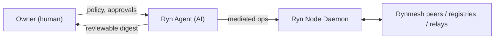
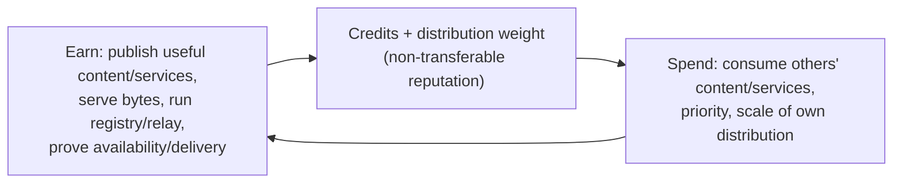

# Rynmesh Vision (North Star)

This document sits **above** [`ARCHITECTURE.md`](ARCHITECTURE.md) and
[`RYN_NODE_WEBAPP_SPEC.md`](RYN_NODE_WEBAPP_SPEC.md). Those describe *what is
built and how*. This describes *where we are going and why*, the stances we are
taking on the hard problems, and the order we build in. Every milestone is
sequenced against this document. When a design decision conflicts with an
existing doc, this document states the intended direction and the other docs are
updated to follow.

Status: direction-setting. Sections marked **Stance** are decisions. Sections
marked **Open** are unresolved and must not be silently resolved in code.

---

## 1. Thesis

Rynmesh is an **AI-agent-first, company-less content and service mesh**.

**First principle.** Anyone with valuable content, an app, or a service earns
adequately for it; no central intermediary (Apple, Google, Meta) extracts value
without itself contributing to the network. Companies are not excluded — the
network is neutral to *who* runs a node (§5.1) — but a participant earns only by
contributing content, services, or plumbing, never by owning the rails and
taxing others' work.

A person downloads one thing — the Ryn node — and is immediately a participant.
They do not browse feeds or fill out post forms. Their node runs a local **AI
agent** that continuously, in the background:

1. **explores and curates** what the network offers — video, images,
   documents, datasets, code, and **services** (productivity tools and
   entertainment, including games) — and presents a reviewable, receipt-backed
   digest to its owner;
2. **publishes** the owner's media and services so the owner **earns credits and
   reputation**;
3. **does network plumbing** — serving bytes, running a registry or relay tier,
   attesting availability — which **also earns credits**.

Credits are the only currency. They are earned by contribution (useful content,
useful services, or useful infrastructure work) and spent to consume what other
nodes' agents produced. There is no company, no platform fee, no central ranking
algorithm, and no single party that decides what may be posted or what a user
sees. Distribution power is itself the network's native equivalent of
advertising: a high-credit node's posts are reviewed and seen first, so if the
work is genuinely good it reaches many users and earns more — and if it is not,
it earns nothing and is penalized. There is no ad market and no ad revenue;
reach is **earned by being good**, and brand and distribution value accrue to
the **participants of the network**, not to an intermediary.

**Why this exists.** Today Meta, Google, and YouTube decide what billions see
and enjoy and capture the majority of the value real creators produce; Apple and
the app-store model take ~30% of every app and service developer's work as a
distribution tax. In both cases the contributor does the hard work and the
platform keeps the reward, the audience, and the rails. That asymmetry — for
content *and* for services/apps — is the injustice Rynmesh exists to correct:
the credit economy and the **services primitive (§3.2)** are the no-rake,
peer-distributed alternative for app and service creators, just as the content
layer is for media creators. As consumption shifts from humans browsing to AI
agents acting for their owners, there is a narrow window to build this
agent-first, **democratic, contributor-owned** network *before* an incumbent
builds and controls a closed one. Reaching scale first is the whole game; being
**fully open with zero proprietary strings** (§5.5) is what earns the
contributors, trust, and momentum to do it. The on-ramp is
also not gated by AI wealth — the node ships a bundled, improving local model so
anyone with a good idea and the work to back it can contribute and earn without
paying for a frontier model; bring-your-own-frontier is optional, never
required, with no platform markup (§2).

**Honest scope.** Rynmesh dissolves the platform rake for *Rynmesh-native*
services (cross-platform, agent-invoked, credit-metered) and content. It does
**not** remove Apple's OS-level gatekeeping for *native iOS apps* — those still
ship through Apple's store on Apple's hardware. The win is making the
Rynmesh-native path compelling enough that value migrates to it, not pretending
the App Store's OS lock can be wished away.

**One former asterisk, now removed (see §5.5):** earlier drafts made Rynmesh's
verifiable-AI core, **Avaryn**, a proprietary trust root that minted the
work/safety receipts the whole network verified — the one owned dependency in
an otherwise ownerless network. That dependency is gone
([DECISION_AVARYN_SEPARATION.md](DECISION_AVARYN_SEPARATION.md)): Rynmesh is
fully self-contained MIT open source with **zero proprietary dependencies**,
and the trust spine — peer-signed manifests, publisher-signed run receipts,
provenance chains, identity tiers, credit/EigenTrust — is entirely open. Avaryn
is repositioned as an **optional** third-party attestation/service provider
that plugs in through the open manifest `attestations` field, competing on
attestation quality and earning trust weight like any participant. There is no
owned dependency left to become a fee or control lever over participants.

YouTube/Instagram/Facebook/Reddit are human-read, human-post, and
platform-owned: the platform ranks, the platform monetizes, the platform
adjudicates. Rynmesh inverts all three — the agent acts, the receipts are
inspectable, and the participants own the value.

> Existing design principle (ARCHITECTURE.md): "YouTube says trust our
> algorithm. Rynmesh says inspect the receipts, choose your registry, choose
> your feed policy, and let distribution weight come from verifiable
> contribution." This vision keeps that principle and makes the **AI agent** the
> primary actor on top of it.

---

## 2. Actor Model

- **Owner**: sets policy and budgets, approves high-risk actions, consumes the
  curated digest. Not required to browse or post manually.
- **Ryn Agent**: the autonomous actor. It is the "AI Curator" of
  `RYN_NODE_WEBAPP_SPEC.md` **elevated to an economic agent** — it not only
  recommends, it acts within an envelope (explore, fetch, publish drafts, run
  plumbing, spend/earn credits).
- **Node daemon**: the authority and the privacy/safety boundary. Every agent
  action goes through it. Unchanged from existing docs.

**Stance — Agent Autonomy Envelope.** The agent operates inside an explicit,
owner-configurable envelope:

- **Budgets**: credit spend/earn caps, bandwidth, storage, model spend, per
  period.
- **Defaults at install**: a new node ships with conservative-but-active
  defaults so it participates immediately (explore + curate + serve cached
  bytes + light plumbing) without manual setup, while **publish** and other
  high-risk actions default to *prepare-and-ask*, not auto-execute.
- **Approval line**: the high-risk list in `RYN_NODE_WEBAPP_SPEC.md` (publish,
  trust a root, change safety policy, enable cloud model, fetch full under
  restriction, quarantine a peer) still requires explicit human confirmation.
  The agent may *prepare* and *recommend* these; it may not *commit* them.
- **Auditability**: every autonomous action writes a local, inspectable event.
  The owner can always answer "why did my node do that?"

**Stance — Agent intelligence: a zero-cost floor, an optional frontier
ceiling.** The Ryn node ships with a **bundled local model** so that *anyone* —
no API budget, no subscription — can download it and immediately produce and
earn. That local model is expected to **improve over time** (shipped updates;
Rynmesh can distribute its own model improvements as content/services). A user
who wants higher-quality output may **plug in their own frontier model** (API
key or subscription token); the network takes **no markup** — the key is the
user's, consistent with the privacy model (local-only mode still blocks cloud
calls).

Honest nuance: model access scales the *magnitude/quality* of contribution, not
*eligibility* — you still earn purely by validated value (First principle,
§5.1), no rake either way. But "anyone can earn" is only genuinely democratic if
the bundled model is good enough to meaningfully participate: the local-model
**floor is the equity guarantee**, and keeping that floor rising is a
first-class obligation, not a nice-to-have. Value also comes from human idea +
effort, not model horsepower alone; the floor plus the newcomer carve-out (§4)
keeps the door open.

**Open — Agent contract details.** The concrete schema for budgets, the default
profile values, and the policy language the owner edits are not yet specified.
Tracked for milestone M2.

---

## 3. What Flows Through the Mesh

Two categories, one trust spine (peer-signed manifests, publisher-signed run
receipts, provenance chains, safety receipts, identity tiers, credit-weighted
distribution — all open, all already in `ARCHITECTURE.md`).

### 3.1 Content (exists today as primitives)

Video, images, audio, documents, slides, datasets, code artifacts, reports, and
future multimodal packages. Content-native publishing already exists; this
vision does not change it.

### 3.2 Services (first-class — the major new surface)

A **service** is a signed, discoverable, **invocable** capability published by a
node: a productivity tool, an API-like function, or an entertainment experience
including games. Services are not files; they are *things other agents can
call*.

The seed already exists: the Signal50 Veo **work-order / job-capacity / relay**
mechanism (`relay.py`, registry mailboxes, `webapp/src/screens/Services.tsx`) is
exactly "requester submits a signed job → provider executes → artifacts relay
back," currently hardcoded to one operation. The services primitive
**generalizes that pattern** into an open marketplace.

**Stance — services are first-class and earn credits like content.** Running a
useful service for other nodes is contribution and is rewarded on the same
credit spine as publishing useful media. This is also Rynmesh's answer to the
~30% app-store tax: a service creator distributes and is rewarded peer-to-peer
with **no platform rake** (subject to the *Honest scope* in §1).

**Open — services execution model.** Where untrusted service code runs (provider
node vs. sandboxed-at-requester vs. relayed job only), the invocation/metering
contract, and result verification are **not** decided. This is the single
biggest new protocol design and gets its own document (`RYNMESH_SERVICES.md`) at
milestone M3. Do not generalize `Services.tsx` ad hoc before that design exists.

---

## 4. The Credit Economy

Credits are **non-transferable signed reputation events** that produce a
transparent `distribution_weight` (already in `ARCHITECTURE.md` →
Rynmesh Credits / Ranking). This vision keeps that and makes the loop the
network's only economy.

**Sources** (earn): safe content/service publication, preview/full serving,
registry operation, relay operation, availability/delivery attestation, useful
service execution.

**Sinks** (spend): consuming others' premium/large content and services,
prioritized distribution of one's own work, higher fetch/scale limits.

**Stance:**

- Credits are **not a token**, not transferable, not a coin in this phase
  (consistent with ARCHITECTURE non-goals and the staged future-token path).
- The economy must have **real sinks**, not only sources, or distribution weight
  inflates and becomes meaningless. Sink design is a release gate for any
  public phase.
- Infrastructure work (registry/relay/availability) is **first-class earning**,
  not charity — this is what keeps the mesh resourced without a company paying
  for servers. It earns **independently of whether any content is consumed**,
  validated by the peers who used the infrastructure (relay/registry/
  availability proofs), not by a content audience — a relay that carried real
  traffic for validated peers earns; one serving nobody earns nothing.
- **Reach is earned, not bought.** Higher credit = more distribution power =
  reviewed and seen first. This is the only "advertising" the network has and it
  cannot be purchased — only earned by work real users' agents validate, and
  lost when they reject it.
- **Validation is credit-weighted (the linchpin).** Approval and disapproval
  signals are themselves weighted by the rating node's credit/identity tier. A
  swarm of fresh `unverified` nodes cannot manufacture approval for its own spam
  or brigade a rival, because their judgments carry ~zero weight.
  Non-transferability stops credit being *moved*; weighted validation stops it
  being *fabricated*.
- **Newcomers can still rise.** A reserved fraction of discovery bandwidth for
  new/low-credit nodes (already in ARCHITECTURE ranking) is mandatory, or
  weighting would permanently lock out good new entrants. The Sybil-resistance
  vs. openness tension is resolved by this exploration carve-out, not by
  dropping weighting.
- **Earning uncapped, power sublinear.** A participant always earns *more credit*
  by contributing more (incl. big-company-scale plumbing — welcome, §5.1). But
  the mapping from credit to *distribution and validation weight* is
  **sublinear / saturating at extreme single-entity concentration**, so no
  actor, however large or legitimate, can convert raw scale into dominant
  control over what the network sees or validates. Contribution is always
  rewarded; capture is structurally bounded. Saturation parameters — Open, M5.

**Open — anti-inflation and pricing.** Concrete credit issuance/decay rates,
consumption pricing, and category scoreboards are unspecified. Milestone M5.

**Stance — credit now, money later (separate stage, heavy gate).** The mission
includes contributors earning not only reputation but eventually **money**. That
is a *distinct future stage*, not a relabeling of credits: non-transferable
reputation and a transferable, money-like instrument are different systems with
different rules. Introducing transferable/redeemable value triggers securities,
money-transmission, tax, and KYC/AML exposure in most jurisdictions — a hard
legal gate, sequenced after M6 and never blended silently into the
credit-reputation layer. Until that stage, credits remain non-transferable
reputation (consistent with ARCHITECTURE's staged future-token path).

**Stance — early-contribution premium via decaying issuance (the adoption
flywheel).** Early adopters should lead — but through credit they *earned by
contributing when the network was small and risky*, not through a permanent
identity bonus. Mechanism: the issuance *rate per validated contribution* is
front-loaded and **decays on a halving-style epoch schedule** toward a floor.
The same useful, validated action mints more credit in epoch 1 than in epoch 50;
the accumulated credit then compounds normally via distribution weight. This is
the sound form of the "bitcoin-like" early advantage — like early miners,
pioneers accumulate a large *earned* stock under high early issuance and that
stock compounds; persistence comes from compounding of **earned stake**, not
from a permanent per-node multiplier.

Invariants this preserves (a permanent early-mover multiplier would violate all
three): earning stays **value-only** — the multiplier applies to *validated
contribution*, so it is not Sybil-farmable at genesis (§5.5); a late creator's
equal-value work **still earns** at the current rate, so the First principle
holds and the 1M-era long tail is not disenfranchised; credits remain
**non-transferable**. The early advantage is real and strong, but meritocratic
and self-limiting rather than a permanent caste. This doubles as the economic
**cold-start incentive** (§5.4). Emission-schedule parameters (epoch length,
decay curve, floor, per-contribution caps) are **Open** — M5.

**Refinement — early presence *is* a contribution, measured honestly.** Joining
and staying live early is itself valuable: pioneers bear failure risk and supply
the density that makes the network usable for the next entrant. This is
recognized as a first-class contribution type — but measured as *demonstrated
early participation*: validated work plus **sustained proof-of-availability /
liveness** through the risky early epochs (already a credit source, §4 Sources).
It is **not** a registration timestamp — a bare genesis join that serves nothing
provides zero density and earns nothing, or the genesis-Sybil hole reopens
(§5.5). "Being early" thus earns through the same value-/validation-gated,
decaying-issuance credit, with early *sustained availability* admitted
explicitly as contribution, not as a free birthright. The award for early
sustained availability/plumbing is **reasonable and bounded — non-zero and not
a caste**: a defined positive rate under the decaying schedule (parameters M5),
so an honest node that joins early and stays reachable is meaningfully rewarded
for committing to the network when it was risky.

---

## 5. Hard Problems and Our Stances

These gate "serious alternative to the incumbents." `ARCHITECTURE.md` already
lists most as Phase-2 TODO; here we take a position.

### 5.1 Neutrality and self-cleaning — **Stance**

The network is **neutral to who operates a node**. Every node is equal except
for its credit. It does not care whether one entity runs one node or ten million
— it cares only about the value of the content/services those nodes provide. An
entity that runs millions of nodes and provides genuinely useful work is *good
for the network*; an entity that runs millions and provides spam gains nothing.
**Big-company-scale plumbing is explicitly welcome** — large funded
relay/availability capacity means faster upload/download and more reachable
content for everyone; the network *wants* this. The safeguard is in the weight
curve, not a gate: throughput/availability earns **uncapped**, but credit's
*power* (distribution and validation weight) is **sublinear at extreme
single-entity concentration** (§4), so legitimate scale always earns more yet
can never silently buy editorial or validation control over what others see —
preserving "no single party decides what users see."
There is no fee and no authority deciding *what* you may post — but node
identity and client conformance are admitted collectively (see *Attested clients
and admission control* below). The network is open to anyone willing to run a
conformant, attested node.

**Why this can work here when it fails on human platforms.** Spam and abuse
overwhelm YouTube/Reddit/etc. because moderation is a human bottleneck — no
human population can review and punish at the rate bad content is produced. In
Rynmesh every node is an AI agent, so detection and punishment scale *with* the
network: a malicious node is evaluated in parallel by every peer it touches,
continuously, at machine speed. Moderation capacity grows with the attack
surface instead of lagging it.

Three compounding properties make abuse self-defeating:

- **Credit is non-transferable.** It cannot be bought, sold, or moved between
  nodes. A node has credit only because real users' agents validated its actual
  contributions.
- **Bad credit collapses fast.** Even if an attacker concentrates large credit
  on one node, the moment it posts spam or low-value work, real users' agents
  downrank and penalize it; credit earned by genuine validation is destroyed by
  genuine rejection in proportion to real reach.
- **Enforcement is collective and automatic.** Every node's AI agent judges
  peers independently and locally — there is no single point to capture, bribe,
  or DoS. Illegal or policy-violating content is cut off by each receiving
  node's own security agent; once discovered, the offending node is banned or
  loses significant credit network-wide.

**Defense in depth — the official client.** The official rynnode app (the Tauri
app being built) refuses by construction to emit illegal or policy-violating
content. This is a real first layer: it protects honest users from mistakes,
and since most participants run the official client, it removes the bulk of
casual abuse at the source. Spinning up millions of *official-client* nodes
therefore cannot, by itself, inject prohibited content.

**Honest caveat — the client is not the security boundary.** Rynmesh is an open,
permissionless protocol with public source (MIT, public repo). A determined
attacker need not use the official client; they can speak the wire protocol with
a hostile reimplementation that ignores every client-side guard. Client-side
incapacity is therefore defense-in-depth, never the guarantee. The binding
guarantee is **receiver-side**: every node validates, safety-scans, and
credit-judges what it receives regardless of which client produced it. Client
guards raise the cost and protect the honest majority; receiver-side collective
AI enforcement is what actually makes the network unharmable. The architecture
must never assume peers run trusted software.

**Stance update — attested clients and admission control.** Near term we assume
all participants run the official Ryn node. Beyond that: (1) each node has a
**registry-anchored signed node identity** ("special ID") — a node cannot enter
without it, and entry is subject to **collective approval** by peers' AI agents,
credit-weighted per §4; (2) any new or alternative client is **reviewed and
rated by participants' AI agents**, and only an allowlisted **attested build**
may present as an official Ryn node. This makes the "everyone runs a conformant
client" assumption defensible rather than wishful.

Open source strengthens this layer — reviewers audit the *actual source* of a
submitted client, the protocol and receipts are publicly verifiable, and there
is no security-through-obscurity. But three honest limits stand:

- **"Many eyes" is not automatic.** Heartbleed and the xz-utils backdoor lived
  in scrutinized open source for a long time. Effective scrutiny is a *funded,
  sustained, competent* review process — a project responsibility, not a free
  property of being public.
- **Open source does not stop hostile forks at runtime.** It arguably makes
  hostile reimplementation *easier* (full spec + reference code). Reviewing a
  *submitted* build never proves a *connecting* peer runs it; a node can present
  an attested identity while executing modified code. Full closure needs
  hardware roots of trust (TPM / Secure Enclave) — a possible future, not an
  alpha guarantee.
- **Admission moves trust into the registry.** A registry that validates IDs and
  gates entry becomes an admission/trust authority — this **contradicts current
  `ARCHITECTURE.md`** ("a registry is not a trust authority; peer records are
  self-signed"). It is a deliberate shift from *permissionless* to
  *permissioned-by-collective-attestation*; `ARCHITECTURE.md` must be reconciled
  and "who Sybil-protects the admitting collective" is **Open** (M4).

Net: open source + attested clients + admission control is a strong layer that
makes the official-client assumption reasonable and the protocol auditable;
receiver-side behavioral enforcement remains the *runtime* guarantee, because
audited identity ≠ proven runtime code.

The frictionless trilemma is thus resolved not by adding cost to entry but by
making abuse **economically and structurally self-defeating**: harm cannot
accrue power, because power comes only from validated value, weighted by the
validators' own credit (§4 linchpin), and judged at machine speed by every
receiver.

**Open — collusion and brigading resistance.** The remaining real attack is not
Sybil entry or the official client but *fabricated validation*: a colluding
cluster wash-rating its own content, or coordinated disapproval against a rival,
possibly via hostile clients. Credit-weighted validation (§4) raises the cost,
but the concrete weighting curve, collusion detection, hostile-client
conformance checks, and newcomer exploration carve-out parameters are
unspecified (M4).

### 5.2 Decentralized safety and legality — **Stance + hard gate**

A public peer mesh *will* be targeted with illegal/infringing/abusive content.
With no company there is no central takedown authority. Position:

- The current keyword scanner is a **placeholder**, not the safety model.
- **Release gate**: public operation is blocked until there are stronger safety
  packs, model-assisted classifiers, evidence retention, quarantine/appeal
  flows, and coordinated cross-node slashing. Local nodes enforce policy; bad
  actors are slashed and quarantined; registries can specialize by safety
  policy.
- **Legal review is mandatory** before any public network. "No company" does not
  mean "no accountable steward of the protocol/root registry." Who that steward
  is, and in what jurisdiction, is **Open** and must be answered before public
  launch, not after.
- **Honest caveat**: collective AI enforcement reduces single-point failure but
  does not make safety solved — classifiers are adversarially evadable,
  "unhealthy" is a *per-node policy* judgment (not objective), and registries
  specializing by safety policy can fragment the network into policy-divergent
  regions. Strong safety packs, appeals, and false-positive/censorship review
  remain mandatory. Neutrality-to-actor does **not** extend to
  neutrality-to-content.

### 5.3 Transport at scale — **Stance**

Direct HTTP only is fine for the LAN/alpha mesh (current home machines) and is an
explicit non-goal to exceed *now*. Millions of NATed nodes require NAT
traversal / libp2p-style transport, a DHT-ish discovery layer, and the
**multi-tier registry topology actually implemented and credit-incentivized**
(it is currently only diagrammed). Scaling track, M4.

### 5.4 Cold-start — **Stance**

The mesh is worthless until populated; AI auto-publishing can bootstrap it but is
also the spam vector. Bootstrap via curated genesis content from trusted-root
operators + agent seeding *inside* the Sybil/safety guards above, never before
them. The *economic* bootstrap is the front-loaded decaying issuance (§4):
early validated contribution earns at a higher rate — the legitimate,
value-gated "early adopter" incentive that drives the first wave, distinct from
the permanent early-mover multiplier §4 rejects.

### 5.5 Fully open trust spine; Avaryn as optional attestation — **Stance**

Rynmesh — protocol, node, client — is **fully open source (MIT) and fully
self-contained, with zero proprietary dependencies**
([DECISION_AVARYN_SEPARATION.md](DECISION_AVARYN_SEPARATION.md), adopted
2026-07-30). The trust spine is entirely open: peer-signed manifests, the
**RunReceipt** (a *publisher-signed* run record, formerly "AvarynRunReceipt"),
provenance chains, identity tiers, and credit/EigenTrust. The bundled VPN data
plane is `rynmesh-vpn` (formerly avaryn-vpn); `pip install rynmesh` is
sufficient for everything.

**Avaryn's place.** Avaryn is **proprietary and owned by the project author**,
but it is no longer Rynmesh's trust root or a required dependency of any kind.
It is repositioned as an **optional attestation/service provider** — the first
of potentially many — that plugs in through the open manifest `attestations`
field: a list of signed statements from any issuer, where **receivers choose
which issuer keys to trust and how to weight them** in ranking. Avaryn competes
on the quality of its attestations and earns trust weight the same way every
participant does. Avaryn remains a shared substrate across the author's other
products (ClawPad, Signal50, and future Avaryn systems); whether and when
Avaryn itself opens is a **business decision external to the Rynmesh
protocol** — nothing in the network gates on it.

**History — the superseded open-core plan.** Earlier revisions of this section
made Avaryn the proprietary trust root: it minted the work/safety (Avaryn/PURR)
receipts every receiver verified before trust or propagation, the closure was
framed as a deliberate moat opened in stages (Phase 1 fully closed → Phase 2
spec-open/engine-closed, "the SQL of AI agents" → Phase 3 fully open under a
governance committee), locality was decided as local-in-node, and OQ-9/OQ-10
tracked the resulting assurance and boundary problems. That plan is
**superseded**, for the reasons recorded in the decision doc: the hard
dependency was an illusory moat — Rynmesh is MIT, and the "Avaryn receipt" was
in practice self-minted locally by the publishing node, so a fork's stub would
have been functionally identical; a closed binary on a user-controlled machine
is obfuscation, not a trust root; and "fully open, no strings" is the
positioning that actually earns contributors and users for a decentralization
project. The local-vs-remote fork over where Avaryn runs is therefore **moot**:
where an optional attestation provider runs is its own operational concern, not
a protocol question.

**What survives from that analysis — trust is key-based, never
obscurity-based.** The one durable insight stands and now applies to *every*
attestation issuer, Avaryn included: trust must rest on **signature
verification against an issuer's published keys**, never on a secret algorithm.
Attestations in the `attestations` field are verifiable by the open spec using
the issuer's public keys; issuers advertise pubkeys and attestation kinds like
any other service provider (registration flow to be defined with the services
primitive, M3). If any issuer's trust ever rests on a secret *algorithm*, that
path is **forbidden** — receivers cannot verify it, and unverifiable
attestations carry no weight.

**The runtime guarantee is unchanged.** The answer to §5.1's attestation hole
is what it always really was: **receiver-side collective enforcement** — every
node validates, safety-scans, and credit-judges what it receives regardless of
which client produced it — on top of the open trust spine, optionally
reinforced by third-party attestations from issuers a receiver chooses to
trust. No single issuer, Avaryn included, is a single point of trust, failure,
or control over the network.

---

## 6. Non-Goals (this phase)

Reaffirming and extending `ARCHITECTURE.md`:

- Not a blockchain; credits are not a transferable token or coin.
- No central ranking algorithm and no platform fee. The protocol layer is
  ownerless/open with **zero proprietary dependencies**; Avaryn is an optional
  third-party attestation provider (§5.5), never a required dependency, a trust
  root, or a platform owner.
- No advertising market and no ad revenue — reach is earned via credit-driven
  distribution power, not sold.
- Not actor-biased — neutral to *who* runs a node (one entity or millions); it
  judges only content/service value. Neutrality stops at content: illegal /
  policy-violating material is cut off per local policy regardless of operator.
- Client-side guards are not the security boundary — receiver-side validation by
  every node is. The protocol must never assume peers run trusted software.
- Not a human-first social feed — the human reviews and steers; the agent acts.
- Not exceeding direct-HTTP transport until the scaling milestone.
- The Ryn frontend is a node-controlled webapp by design — **not** an Electron
  app. It is packaged for end users via a Tauri shell (decision of record;
  Electron explicitly excluded for the Chromium-weight and process-model reasons
  in the desktop plan).

---

## 7. Milestone Sequencing

The Tauri desktop app is the **on-ramp** and is on the critical path regardless
of how the open problems resolve — without a one-download instant participant,
none of the vision is reachable.

| M | Milestone | Content | Gate to next |
|---|-----------|---------|--------------|
| **M0** | Protocol primitives | *Done* — signed manifests, provenance, credits, identity tiers, registry, relay, peer HTTP, MCP (ARCHITECTURE Phase 1). | — |
| **M1** | **On-ramp (Tauri "Ryn" app)** | One signed download → node daemon + UI + conservative-active agent defaults + safety floor + visible contribution loop. Built per the Tauri desktop plan. | A non-developer can install and immediately participate (explore/curate/serve) safely. |
| **M2** | Agent autonomy | Agent contract: budgets, default profile, policy language, model adapters, background explore/curate/publish-draft/earn loop, full audit log. | Agent runs unattended within envelope without owner babysitting. |
| **M3** | Services primitive | `RYNMESH_SERVICES.md`: service manifest, invocation/metering contract, execution model, result verification — generalizes the Signal50 work-order/relay. | Open services (incl. games) can be published, discovered, invoked, and earn credits. |
| **M4** | Scale & safety hardening | Anti-Sybil, stronger safety packs + appeals + slashing, NAT/libp2p transport, registry tiers + incentives, proof-of-availability/delivery. | Network can survive adversaries and NAT at scale. |
| **M5** | Economy maturation | Credit sinks/pricing, anti-inflation, category scoreboards, policy-pluggable ranking, owner preference profiles. | Distribution weight stays meaningful under load. |
| **M6** | Public-viability gate | Legal/safety review, accountable-steward decision, moderation tooling, collusion/brigading + hostile-client hardening. | Decision to operate a public network. |

**Dependency rule:** public launch is gated on **M4 + M6** together. M1–M3 can
proceed on the home/private mesh. Do not ship publicly on M1–M3 strength alone.

---

## 8. Open Questions (must be answered explicitly, not in code)

1. Services execution model (provider-run vs sandboxed vs relay-only) — M3.
2. Collusion/brigading resistance: validation-weighting curve, collusion
   detection, hostile-client conformance checks, newcomer exploration carve-out
   parameters — M4.
3. Accountable steward of protocol + root registry, and its jurisdiction — M6,
   but legal scoping should start early.
4. Credit issuance/decay/pricing parameters, incl. the early-contribution
   emission schedule (epoch length, decay curve, floor, per-contribution caps)
   — M5.
5. Agent default-profile values and policy language — M2.
6. Definition and scope of "unhealthy", and how policy-divergent registries are
   prevented from fragmenting the network — M4/M6.
7. Governance: how protocol changes are decided in a company-less network.
8. Client attestation & admission: reconcile registry-as-admission-authority
   with ARCHITECTURE's "registry is not a trust authority"; runtime attestation
   limits (software vs hardware roots of trust); a funded sustained client-audit
   process; admission bootstrapping without gatekeeper centralization — M4.
9. Avaryn open-core: structural (not just social/intent) assurance the bootstrap
   trust root cannot become a fee/control lever before it is opened — M6.
   **Resolved**
   ([DECISION_AVARYN_SEPARATION.md](DECISION_AVARYN_SEPARATION.md)): Avaryn is
   no longer the trust root or a dependency at all, so there is no owned lever
   left to assure against.
10. **Decided: Avaryn runs local-in-node (§5.5).** Remaining: the clean
    open/proprietary dependency boundary in the OSS repo (Avaryn consumed as an
    external proprietary package, not vendored into the open tree) — before M1.
    **Resolved** (DECISION_AVARYN_SEPARATION.md): the boundary is the open
    manifest `attestations` field — Rynmesh has zero proprietary dependencies
    and no avaryn package anywhere in the tree, and the locality question is
    moot for an optional external provider.
11. Open-standard transition: governance, versioning/conformance, third-party
    adoption for Avaryn/PURR as "the SQL of AI agents," and the trust-model
    handoff from issuer-secrecy to pure cryptographic verifiability when it
    opens — post-M6 track.
    **Resolved** (DECISION_AVARYN_SEPARATION.md): the trust model never rests
    on issuer secrecy — attestations verify against issuers' published keys
    from day one, and Avaryn/PURR standardization is Avaryn's own business
    track, external to the Rynmesh protocol.
12. Contributor *money* (transferable/redeemable value): legal structure
    (securities / money-transmission / tax / KYC-AML) and strict separation from
    the non-transferable credit layer — post-M6, legal-gated.
13. Staged-opening triggers & governance: concrete definition of "network large
    enough" (Phase 2) and "dominant + hardened + committee" (Phase 3), plus a
    structural commitment (not just intent) that the openings occur — M6.
    **Resolved as moot** (DECISION_AVARYN_SEPARATION.md): Rynmesh is already
    fully open; any staging of Avaryn's own opening is a business decision
    external to the protocol, so no trigger gates the network.
14. Concentration safeguard: the sublinear credit→weight saturation curve /
    per-entity weight bound that lets legitimate large-scale contribution earn
    uncapped while preventing editorial/validation capture — M5.
15. Local-model improvement mechanism (client updates vs on-device adaptation vs
    network-distributed) and the rising equity floor that keeps "anyone can
    earn" genuinely democratic — M2.

---

## 9. Relationship to Other Docs

- [`ARCHITECTURE.md`](ARCHITECTURE.md) — current built system and component
  detail. This vision supersedes its forward-looking framing where they differ.
- [`RYN_NODE_WEBAPP_SPEC.md`](RYN_NODE_WEBAPP_SPEC.md) — product surface of the
  webapp/node. The "AI Curator" there is this document's "Ryn Agent" before the
  autonomy elevation (M2).
- `RYNMESH_SERVICES.md` — *to be written at M3.*
- Tauri desktop packaging plan — the M1 build (tracked in conversation/working
  notes; to be committed as `docs/RYN_DESKTOP_PLAN.md` when M1 starts).
