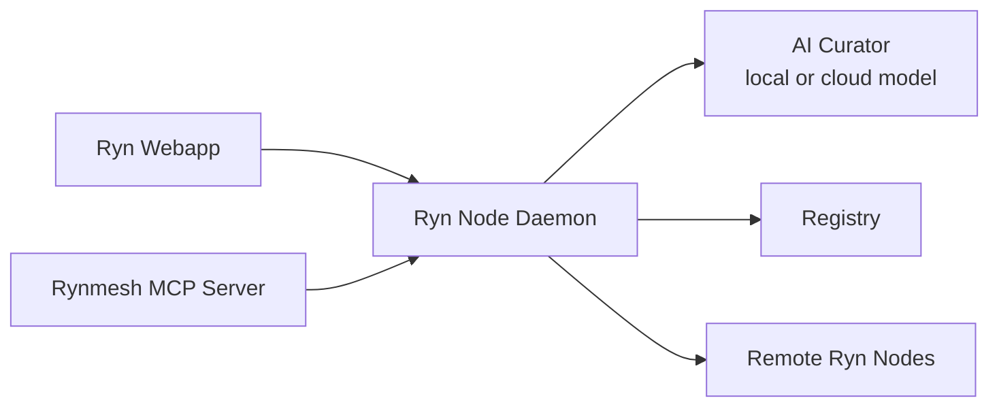

# Ryn Node And Webapp Product Spec

This spec defines the user-facing product shape for Rynmesh. It clarifies the vocabulary, the boundaries between the webapp, the local Ryn node daemon, the MCP server, and the wider Rynmesh network, and the rule that all user and AI operations go through the local node.

## Product Thesis

Rynmesh is the verifiable AI node network for AI-curated content. A user runs a local Ryn node and a webapp. The node discovers, verifies, ranks, fetches, and publishes content. The webapp lets the user inspect what is available, ask an AI curator for recommendations, approve publication, and direct follow-up searches.

The webapp is not the network. The AI model is not the network. The registry is not the network. The Ryn node is the user's trusted gateway into Rynmesh.

## Vocabulary

### Rynmesh

The overall network and protocol. Rynmesh includes peer nodes, registries, signed content manifests, provenance chains, safety receipts, identity tiers, and Rynmesh Credits.

### Ryn Node

The local node controlled by a user or operator. It owns the user's node identity, local store, safety policy, provenance verification, credit ledger view, peer discovery, peer fetching, publishing, and network-facing peer HTTP endpoint.

Product language should prefer "Ryn node" when speaking to users and "Rynmesh node" when speaking about the protocol.

### Ryn Node Daemon

The long-running local server process for a Ryn node. In the current alpha, this role is mostly represented by `rynmesh-peer` plus the local store and peer HTTP API. In the webapp product, the daemon should expose a local control API for the webapp and should continue to expose peer APIs for other nodes.

Responsibilities:

- hold the local node identity key
- maintain local content and fetched content
- register with configured registries
- discover peers through registries
- query peer content lists
- fetch previews, manifests, and bytes from peers
- verify signatures, hashes, safety receipts, provenance chains, and identity evidence
- rank content with local policy
- publish only after explicit local approval
- record credit events for useful work

### Ryn Webapp

The human-facing local GUI for the user's Ryn node. The webapp shows network state, available content, AI-curated recommendations, item details, publish workflows, and settings. It must not bypass the Ryn node to contact registries or peers directly.

The webapp is a control surface. The Ryn node is the authority.

### Rynmesh MCP Server

The agent-facing adapter for the same local node. It lets Codex, Claude, local agents, and other MCP clients call Rynmesh tools. The MCP server should not be a separate source of truth. It should route operations to the local Ryn node/store.

Current command: `rynmesh-mcp`.

### Peer HTTP Server

The node's network-facing HTTP interface for other peers. It exposes node info, local content listings, manifests, previews, bytes, and credit views. Other peers use this API to fetch content directly after discovery.

Current command: `rynmesh-peer`.

### Registry

A discovery coordination service. A registry stores or serves self-signed peer records so nodes can find each other. A registry is not a trust authority and should not be treated as a content host. Nodes must verify all peer records locally.

### Peer

Another Ryn node on the network. A peer can publish content, serve previews and bytes, provide signed evidence, and accumulate distribution reputation.

### Content Item

Any publishable AI-generated or AI-curated artifact: video, image, audio, document, slide deck, dataset, code artifact, report, or future multimodal package. A content item is identified by its content hash.

### Manifest

The signed metadata object for a content item. It binds content ID, hash, media type, preview hash, provenance references, safety receipts, publisher identity, title, description, and tags.

### Provenance Chain

A signed chain describing how the content was created, scanned, attested, or otherwise handled. The chain is tamper-evident because each link references the previous link hash.

### Safety Receipt

A signed verifier result for a content item. Safety receipts are locally checked before propagation. In the webapp, users should be able to inspect safety outcome, scanner identity, policy version, and whether the safety scanner appears in the provenance chain.

### Rynmesh Credits

Non-transferable signed reputation events used for distribution weight. Credits reward useful work and can penalize harmful behavior. They are not a coin in the current architecture.

### Distribution Weight

The ranking weight derived from credit score and, when enabled, identity tier caps. It is transparent and inspectable. It is a signal for recommendation and ranking, not a command users must obey.

### Identity Tier

The local assessment of a peer's trust/reputation level: `unverified`, `attested`, `staked`, or `proven`. Identity tiers constrain what credit events peers can issue and can cap distribution weight.

### AI Curator

The AI model selected by the user to review available materials and generate recommendations. It can be a cloud model or local model. It does not directly operate the network. It asks the Ryn node for data and asks the Ryn node to perform searches or fetches.

### Recommendation

An AI-generated, user-reviewable suggestion. A recommendation must cite the content items and signals it used: manifest metadata, preview text, provenance, safety, peer reputation, query match, user preference, or novelty.

### Search

A user- or AI-initiated request for the node to discover, query, filter, fetch, or rank more network content. Search is executed by the Ryn node, not by the webapp directly.

## Core Rule: All Operations Go Through The Ryn Node

The webapp, MCP server, and AI curator are clients of the local Ryn node. They should never become independent network actors.

Required routing:

- Webapp lists local content through the Ryn node.
- Webapp discovers peers through the Ryn node.
- Webapp requests remote peer listings through the Ryn node.
- Webapp requests previews and full content through the Ryn node.
- Webapp publishes content through the Ryn node.
- AI curator reads content metadata through the Ryn node.
- AI curator requests additional searches through the Ryn node.
- MCP tools call node operations through the Ryn node/store.

This preserves one local enforcement point for identity, safety, provenance, credits, user approvals, and audit logs.

## Installed Runtime Pieces

The user-facing install should be explainable as three pieces:

- **Ryn node daemon**: the local server the user runs. This is the "Rynmesh server" in casual language, but product language should call it the Ryn node daemon.
- **Ryn webapp**: the GUI for reviewing network-visible content, asking for AI recommendations, approving fetches, and publishing material.
- **Rynmesh MCP server**: the optional agent adapter for Codex, Claude, and other MCP clients.

The daemon may expose two different APIs:

- **Local control API**: used by the webapp and MCP server. It enforces local policy and user approvals.
- **Peer HTTP API**: used by other Ryn nodes. It serves node info, manifests, previews, content bytes, and credit views.

Default routing:

The webapp and MCP server may feel like separate products, but they are interfaces to the same local node.

## User Mental Model

Users should understand Rynmesh as:

1. My Ryn node is my local gateway.
2. The webapp is how I see and steer it.
3. AI helps me review and curate what the node can see.
4. I decide what to fetch, trust, publish, or ignore.
5. Every network item has receipts I can inspect.

## Primary Webapp Screens

### Home

Purpose: Give the user a compact status view.

Required data:

- local node name and peer ID
- daemon status
- registry status
- peer count
- local content count
- fetched content count
- pending recommendations
- recent publish/fetch/verification events

Primary actions:

- open Explore
- ask AI curator
- publish content
- review node settings

### Explore

Purpose: Let users browse available content from local and discovered peers.

Required controls:

- source: local, fetched, discovered peers, specific peer
- content kind filter
- safety outcome filter
- identity tier filter
- provenance status filter
- rank mode: distribution weight, newest, trusted, AI-curated, novelty
- search query

Required item fields:

- title
- summary or preview snippet
- content kind and type
- source peer
- provider peer
- distribution weight
- safety status
- provenance status
- fetch status

### Recommendations

Purpose: Show AI-curated suggestions for user review.

Recommendation cards must include:

- item title and preview
- why the AI recommends it
- evidence used
- confidence or priority
- safety and provenance badges
- source peer and identity tier
- actions: inspect, fetch preview, fetch full, hide, ask for more like this

The AI must distinguish between:

- content it has actually reviewed
- content inferred from metadata only
- content requiring fetch before stronger assessment

### Search And Ask

Purpose: Let users direct the node and AI curator conversationally.

Examples:

- "Find more like this."
- "Show only proven peers."
- "Search design references about urban gardens."
- "Ignore low-trust peers."
- "Fetch previews for the top 10."
- "Explain why item 4 outranks item 7."

The webapp sends the request to the local node. The node decides which peer discovery, listing, fetch, rank, or AI-curation operations are allowed.

### Publish

Purpose: Let users intentionally publish local material to Rynmesh.

Required steps:

1. User selects file or folder.
2. Node builds preview and content hash.
3. Node runs local safety scan.
4. Node builds provenance chain and manifest.
5. Webapp shows a pre-publish review.
6. User confirms publish.
7. Node writes local content, signs manifest, records credit, and announces/registers as configured.

The publish action must be explicit. AI may suggest publishing, but must not publish without user confirmation.

### Item Detail

Purpose: Let users inspect one content item deeply.

Required sections:

- preview
- metadata
- content hash and manifest hash
- publisher identity
- provider identity
- provenance chain
- safety receipts
- credit/reputation signals
- fetch history
- local actions

Primary actions:

- fetch preview
- fetch full content
- recommend more like this
- hide or downrank
- report or quarantine
- copy citation/receipt data

### Peers

Purpose: Show discovered nodes and trust signals.

Required fields:

- peer ID and slug
- node name
- endpoints
- network ID
- identity tier
- credit score
- distribution weight
- last seen
- served/fetched counts when available

### Settings

Purpose: Configure local node behavior.

Settings groups:

- node identity and storage paths
- registry URL
- peer HTTP host/port/public endpoint
- trusted root peer IDs
- safety policy
- model provider for AI curator
- ranking preferences
- publish defaults
- fetch limits and timeouts

## AI Curator Contract

The AI curator must operate as a reviewer and recommender, not as an autonomous network authority.

Allowed:

- summarize visible content
- compare candidates
- rank with explicit reasons
- ask the node to search or fetch more
- suggest publish metadata
- explain provenance and safety signals

Not allowed without user confirmation:

- publish content
- fetch large/full content when the user has restricted bandwidth/storage
- trust a new root
- change safety policy
- hide or quarantine a peer globally
- send data to a cloud model if local-only mode is enabled

The curator response should cite its basis:

- metadata only
- preview reviewed
- full content reviewed
- provenance verified
- safety receipt verified
- peer reputation considered

## Core Operations

### Discover Network

Input: network ID, registry configuration, max age, cache policy.

Node operation:

1. Query registry for signed peer records.
2. Verify peer records.
3. Cache fresh records.
4. Return peers to webapp.

### List Peer Content

Input: peer endpoint.

Node operation:

1. Fetch peer node info.
2. Fetch peer content list.
3. Attach provider identity fields.
4. Return listing for local review.

### Fetch Preview

Input: endpoint, content ID, expected peer ID.

Node operation:

1. Verify provider identity.
2. Fetch signed manifest.
3. Validate manifest, safety receipts, and provenance chain.
4. Fetch preview bytes.
5. Verify preview hash.
6. Store locally.
7. Record credit event.

### Fetch Full Content

Input: endpoint, content ID, expected peer ID.

Node operation:

1. Verify provider identity.
2. Fetch signed manifest.
3. Validate manifest, safety receipts, and provenance chain.
4. Fetch full bytes.
5. Verify content hash.
6. Store locally.
7. Record credit event.

### AI Recommendation

Input: user query, visible item set, local preferences, model configuration.

Node operation:

1. Build a bounded evidence packet from local metadata and fetched previews.
2. Route packet to configured AI model.
3. Receive recommendations.
4. Validate that recommended item IDs exist in local evidence.
5. Return recommendation set with reasons and citations.

### Publish Content

Input: local path, title, description, tags, content kind, model metadata.

Node operation:

1. Hash content.
2. Build preview.
3. Run safety scanner.
4. Build safety receipt.
5. Build provenance chain.
6. Build and sign manifest.
7. Validate manifest locally.
8. Store content.
9. Record credit event.
10. Announce/register as configured.

## Permissions And Confirmations

The webapp should classify actions by risk.

Low-risk actions:

- list local content
- list cached peers
- inspect manifest
- inspect provenance
- run local ranking

Medium-risk actions:

- query registry
- list peer content
- fetch preview
- send bounded metadata to AI model

High-risk actions requiring explicit confirmation:

- fetch full content
- publish content
- trust a new root peer
- change safety policy
- enable cloud model access
- quarantine or report a peer

## Privacy Model

The local node should be the privacy boundary.

Rules:

- Local files do not leave the machine until the user publishes or explicitly sends them to a configured model.
- The AI curator should receive the minimum evidence required for the request.
- Cloud model usage must be visible and configurable.
- Local-only mode must prevent cloud model calls.
- Peer queries may reveal interest; the webapp should disclose this before broad network searches.

## Implementation Notes For The First Webapp

The current repo already has the protocol primitives for:

- local store
- peer HTTP API
- MCP tools
- registry discovery
- content publish/fetch/list/rank
- provenance chain validation
- identity tier assessment
- credit scoring

Missing or future work:

- local webapp frontend
- local webapp control API
- model-provider adapter for AI curation
- recommendation evidence packet schema
- user preference/ranking policy storage
- publish approval UI
- persistent search/recommendation history
- peer quarantine/report UX

## Success Criteria

The first webapp is successful when a user can:

1. Start a local Ryn node.
2. Open the webapp.
3. See node and registry status.
4. Discover peers.
5. Review available content.
6. Ask AI for curated recommendations.
7. Inspect recommendation reasons and receipts.
8. Fetch previews or full content through the node.
9. Publish approved local content.
10. Verify that every network operation is mediated by the local node.
