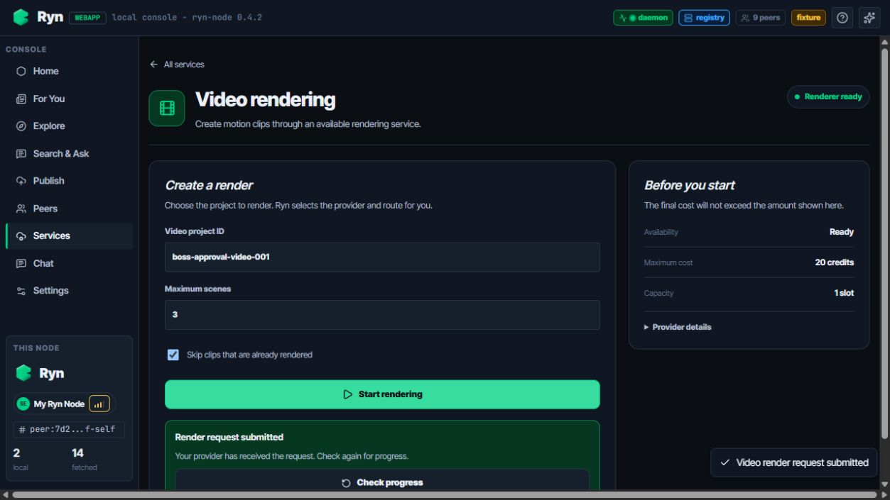

# Services UI browser acceptance

Date: 2026-08-25

Branch: `feature/local-llm-dual-node`

Environment: Vite development server with `client=fixture`

## Acceptance results

- Services catalog: all three service cards rendered; search narrowed the list to Private AI.
- Private AI: created a new conversation, received a response, switched to an older conversation, and filtered conversation history.
- Video rendering: submitted `boss-approval-video-001` with three scenes and received the submitted state.
- Secure web access: connected, verified the CN exit state and displayed price, launched the secure browser action, then disconnected.

## Screenshots

### 1. Services catalog

### 2. Private AI multi-session chat

### 3. Video render submitted

### 4. Secure web connected

