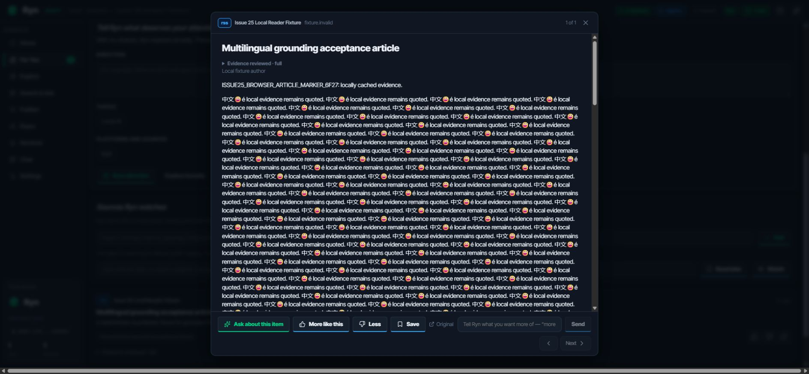
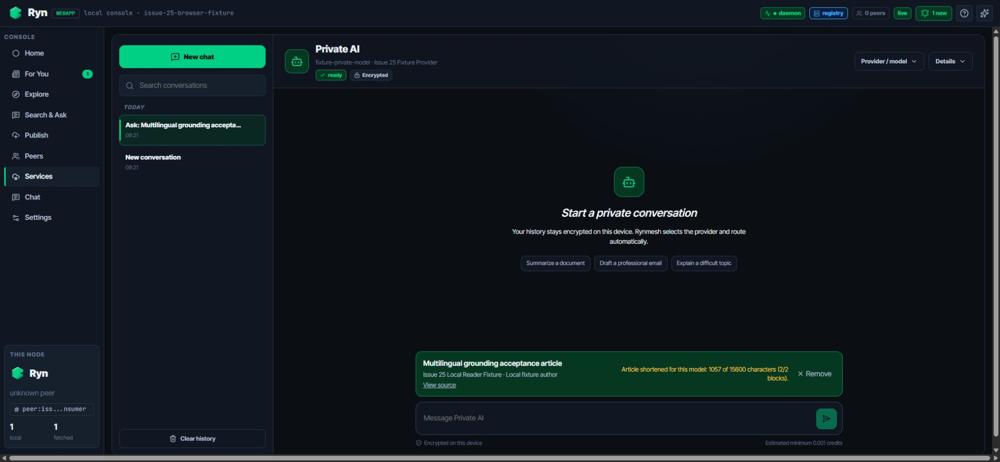
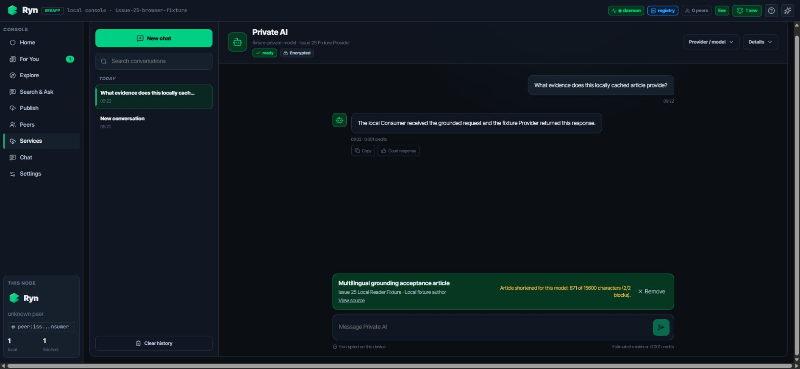
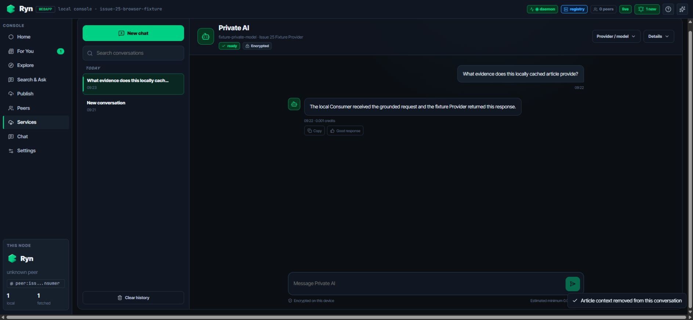

# Issue #25 browser evidence

Captured: 2026-09-03

Scope: deterministic browser acceptance for the local Reader → **Ask about
this item** → grounded Private AI flow. The run used an isolated HTTP Consumer
fixture on `127.0.0.1:18795`, Vite on `127.0.0.1:42527`, and a temporary state
directory outside the repository. Docker, Registry access, and external
Provider access were not used.

## Result

1. The locally cached multilingual article rendered with the Ask action.
2. Ask opened a new grounded conversation using the fixture Provider exposed
   by the local Consumer.
3. The post-consumption URL contained only `peer`, `service`, and `network`;
   the handoff and synthetic article marker were absent.
4. The selected 2,048-token Provider showed deterministic pre-send truncation:
   `1,057 of 15,600 characters (2/2 blocks)` before the question and
   `871 of 15,600` after the question consumed part of the budget.
5. Send reached only `POST /api/local/llm/orders/async`; the fixture returned a
   successful response.
6. Remove deleted the visible article card and displayed the success toast.
7. Browser console warning/error capture was empty.

The companion Web test asserts that title, URL, and article markers are absent
from React Router history state, `localStorage`, and `sessionStorage`. The
encrypted-store test separately proves that persisted grounding is ciphertext.

## Reproduce

Use two terminals from this issue worktree. Choose unused ports if the defaults
are occupied.

```powershell
$stateDir = New-Item -ItemType Directory -Path (Join-Path $env:TEMP ("rynmesh-issue25-browser-" + [guid]::NewGuid()))
D:\code\rynmesh\.venv\Scripts\python.exe scripts/issue25_browser_fixture.py `
  --port 18795 --state-dir $stateDir.FullName
```

```powershell
cd webapp
$env:VITE_RYN_NODE_BASE_URL = "http://127.0.0.1:18795/api/local"
npm run dev -- --host 127.0.0.1 --port 42527
```

Open `http://127.0.0.1:42527/digest`, open **Multilingual grounding acceptance
article**, and repeat the six UI actions above. Stop both processes afterward.
The harness writes only endpoint metadata, body sizes/hashes, and marker
booleans to `requests.jsonl`; it never stores prompt or response bodies.

## Artifacts

- `01-reader-ask-action.png` — cached article and Ask action.
- `02-grounded-truncation.png` — grounded card and visible truncation before send.
- `03-grounded-response.png` — successful local-Consumer response with grounding retained.
- `04-context-removed.png` — article card removed and success toast visible.
- `browser-session.json` — URLs, counts, hashes, and ordered observations.
- `request-evidence.json` — sanitized Consumer request-boundary evidence.
- `console.json` — captured browser warning/error entries.








